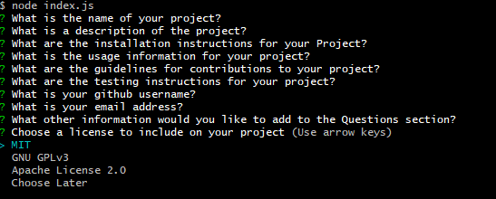

# Generate a good ReadME

MIT License

## Description

With this application you will be able to answer a few simple prompts and have a start to a good proffestional looking readMe.md file.

## Table of Contents

[1. Description](#description)

[2. Installation Instructions](#installation-instructions)

[3. Usage Information](#usage-information)

[4. Contribution Guidelines](#contribution-guidelines)

[5. Test Instructions](#test-instructions)

[6. Questions](#questions)

[7. License](#license)

## Installation instructions

To install this project please go to my github profile and find the project. After that you will need to install the npm inquirer by using the command npm i, in your terminal.

## Usage Information

To use begin in your terminal and use the command node index.js while navigated in the directory with the proper index.js file. This will kick off a series of prompts that you will answer to populate the readMe.md file.\

## Contribution Guidelines

Please ask first before contributing to this project.

## Test instructions

None available at the moment but stay tuned for updates.

## Questions

[Link to my Github](https://github.com/awfiscus)

awfiscus@comcast.net

If you have any questions, please contact me by email.

## License

MIT License

    Copyright (c) [year] [fullname]

    Permission is hereby granted, free of charge, to any person obtaining a copy
    of this software and associated documentation files (the "Software"), to deal
    in the Software without restriction, including without limitation the rights
    to use, copy, modify, merge, publish, distribute, sublicense, and/or sell
    copies of the Software, and to permit persons to whom the Software is
    furnished to do so, subject to the following conditions:

    The above copyright notice and this permission notice shall be included in all
    copies or substantial portions of the Software.

    THE SOFTWARE IS PROVIDED "AS IS", WITHOUT WARRANTY OF ANY KIND, EXPRESS OR
    IMPLIED, INCLUDING BUT NOT LIMITED TO THE WARRANTIES OF MERCHANTABILITY,
    FITNESS FOR A PARTICULAR PURPOSE AND NONINFRINGEMENT. IN NO EVENT SHALL THE
    AUTHORS OR COPYRIGHT HOLDERS BE LIABLE FOR ANY CLAIM, DAMAGES OR OTHER
    LIABILITY, WHETHER IN AN ACTION OF CONTRACT, TORT OR OTHERWISE, ARISING FROM,
    OUT OF OR IN CONNECTION WITH THE SOFTWARE OR THE USE OR OTHER DEALINGS IN THE
    SOFTWARE.

[MIT License Link](https://choosealicense.com/licenses/mit/)
